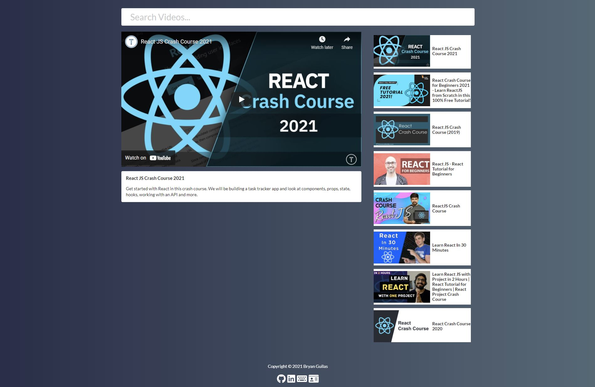

# Video-Search-App
URL: https://festive-davinci-0011c3.netlify.app/

In this project I ultized the YouTube API to create my own video search application using React.
This was a great way for me to learn how state, props and class components work in React. Very proud of t his application! I learned a lot and it was a lot of fun!

# Possible Features to implement in the future

User authentication

Create a back-end using MongoDB

Give user the ability to create an account and be able to save, delete, update  their list of favorited videos

    #Technology
    React
    Javascript
    HTML5
    CSS3
    Node.js
    Semantic-Ui
    Axios
    FontAwesome

# Author
Bryan Guilas

Email: bryanJguilas@gmail.com

GitHub: https://github.com/BGM6
    
RepoUrl: https://api.github.com/users/BGM6/repos
